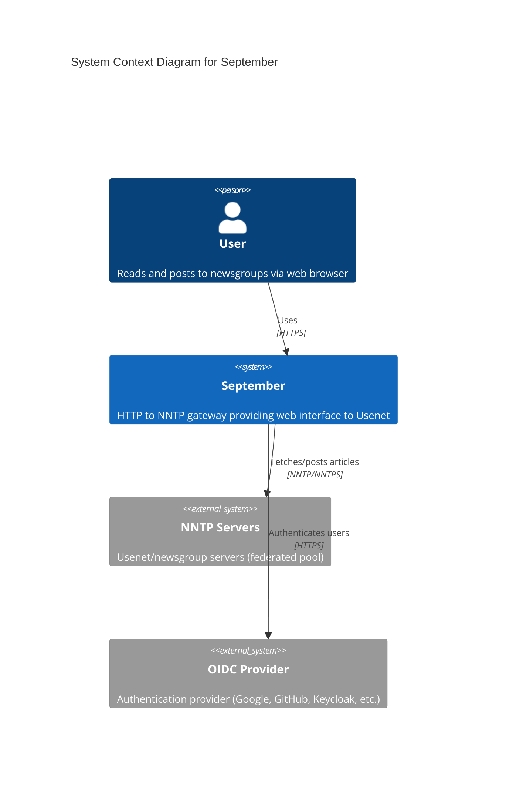
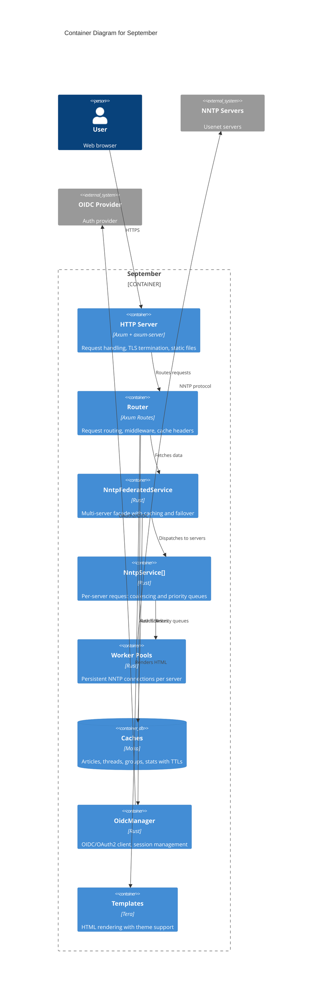
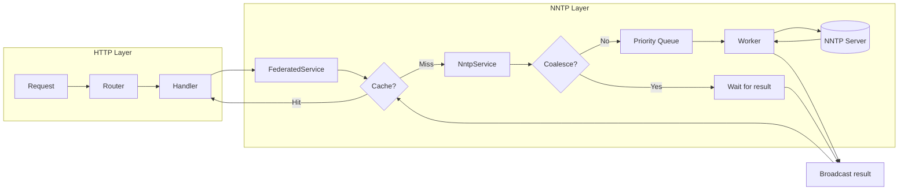

# September Architecture

September is an HTTP to NNTP gateway service providing a modern web interface to Usenet newsgroups. Built with Rust and [Axum](https://github.com/tokio-rs/axum), it features federated multi-server support, priority-based worker pools, multi-tier caching, and optional OpenID Connect authentication.

## System Context



**Design Goals:**

- **Minimize NNTP server load**: Smart caching, request coalescing, and batching reduce redundant operations
- **Low latency for readers**: Priority scheduling ensures user-facing requests are processed first
- **Near-real-time visibility**: Activity-proportional background refresh keeps active groups fresh
- **Resilient**: Multi-server failover, stale-while-revalidate caching, graceful degradation

## Container Diagram



## Key Entry Points

| File | Description |
|------|-------------|
| `src/main.rs` | Application entry point: CLI parsing, config loading, service initialization, server startup |
| `src/routes/mod.rs` | HTTP router creation (`create_router`), route registration, cache header policies |
| `src/nntp/federated.rs` | `NntpFederatedService`: multi-server facade with caching, failover, background refresh |
| `src/nntp/service.rs` | `NntpService`: per-server request coalescing and priority queue dispatch |
| `src/nntp/worker.rs` | `NntpWorker`: persistent NNTP connections, protocol handling, capability detection |
| `src/config.rs` | Configuration loading, validation, defaults, cache control constants |
| `tests/integration/conftest.py` | Integration test fixtures: browser setup, authentication helpers, data seeding |

## Key Abstractions

| Abstraction | Location | Purpose |
|-------------|----------|---------|
| `AppState` | `src/state.rs` | Shared state container (Config, Tera, NntpFederatedService, OidcManager) |
| `NntpFederatedService` | `src/nntp/federated.rs` | Unified interface over multiple servers with caching, coalescing, failover |
| `NntpService` | `src/nntp/service.rs` | Single-server communication with request coalescing via `PendingRequests` |
| `NntpWorker` | `src/nntp/worker.rs` | Persistent NNTP connection with priority queue consumption and auto-reconnect |
| `NntpRequest` | `src/nntp/messages.rs` | Request variants with priority levels (High/Normal/Low) |
| `NntpResponse` | `src/nntp/messages.rs` | Response variants for worker communication |
| `Priority` | `src/nntp/messages.rs` | Request priority enum determining scheduling order |
| `OidcManager` | `src/oidc/mod.rs` | OIDC provider management and OAuth2 client handling |
| `User` | `src/oidc/session.rs` | Session data with expiry, CSRF token, provider info |
| `AppError` | `src/error.rs` | Application error type with HTTP response conversion |

## Data Flow



1. **Request arrives** at Axum router, dispatched to handler
2. **Handler extracts `AppState`** containing `NntpFederatedService`
3. **Federated service checks caches** (article, threads, groups, stats, negative)
4. **Cache miss**: selects server(s) for the group, tries in priority order
5. **NntpService checks coalescing**: if request in-flight, waits on broadcast channel
6. **New request**: sent to appropriate priority queue (High/Normal/Low)
7. **Worker pulls request**: checks queues in order with aging, executes NNTP commands
8. **Response propagates**: broadcast to all waiters, cached, rendered via Tera

## Code Organization

```
src/
├── main.rs              # Entry point and initialization
├── config.rs            # Configuration types and loading
├── state.rs             # AppState shared container
├── error.rs             # Error types and conversions
├── middleware.rs        # Request ID, auth extractors
├── templates.rs         # Tera initialization with themes
├── http/
│   ├── mod.rs           # HTTP module exports
│   ├── server.rs        # Server startup (plain/TLS/ACME)
│   ├── shutdown.rs      # Graceful shutdown handling
│   ├── redirect.rs      # HTTP→HTTPS redirect
│   └── static_files.rs  # Static file serving with themes
├── routes/
│   ├── mod.rs           # Router creation, helpers
│   ├── home.rs          # Homepage and browse handlers
│   ├── threads.rs       # Thread list and view handlers
│   ├── article.rs       # Article view handler
│   ├── post.rs          # Compose, submit, reply handlers
│   ├── auth.rs          # OIDC login/callback/logout
│   ├── privacy.rs       # Privacy policy handler
│   └── health.rs        # Health check endpoint
├── nntp/
│   ├── mod.rs           # Data types, view models, utilities
│   ├── federated.rs     # NntpFederatedService
│   ├── service.rs       # NntpService (per-server)
│   ├── worker.rs        # NntpWorker, priority handling
│   ├── messages.rs      # Request/response types
│   └── tls.rs           # TLS stream wrapper
└── oidc/
    ├── mod.rs           # OidcManager, provider handling
    └── session.rs       # User session, CSRF, cookies
```

## Testing

September uses a multi-layered testing approach:

| Type | Location | Framework | Description |
|------|----------|-----------|-------------|
| Unit | `src/**/*.rs` | `cargo test` | In-module tests for functions and types |
| Integration | `tests/integration/` | Python + Selenium | End-to-end browser automation tests |

### Running Tests

```bash
# Unit tests
cargo test

# Integration tests
cd tests/integration/environment
./setup.sh                    # Start Docker environment
cd ..
uv run pytest                 # Run tests
cd environment && ./teardown.sh  # Cleanup
```

### Test Environment

Docker Compose orchestrates the integration test environment:

| Service | Purpose | Port |
|---------|---------|------|
| `nntp` | Renews NNTP server | 1190 |
| `dex` | Dex OIDC provider | 5556 |
| `september` | Application under test | 3000 |
| `chrome` | Selenium browser automation | 4445 (WebDriver), 7900 (VNC) |

See [Testing](docs/testing.md) for detailed documentation.

## Detail Documentation

| Document | Description |
|----------|-------------|
| [Component Architecture](docs/architecture.md) | Component diagrams, module reference, data flow, design decisions |
| [HTTP Routing](docs/routing.md) | Route table, request flow, cache-control strategy |
| [NNTP Service](docs/nntp-service.md) | Worker pool, priority queues, coalescing, TLS handling |
| [Extending NNTP](docs/extending-nntp.md) | Guide for adding new NNTP actions with capability-aware dispatch |
| [Background Refresh](docs/background-refresh.md) | Activity tracking, refresh period calculation, incremental updates |
| [OIDC Authentication](docs/oidc.md) | Provider configuration, session management, troubleshooting |
| [Testing](docs/testing.md) | Integration test infrastructure, page objects, debugging |

## Configuration

Configuration is loaded from TOML files. See `dist/september.toml` for a complete example.

Key configuration sections:

| Section | Description |
|---------|-------------|
| `[http]` | Host, port, TLS mode (none/manual/acme) |
| `[[server]]` | NNTP server definitions (host, port, credentials, workers) |
| `[cache]` | Cache TTLs and sizes |
| `[theme]` | Template theme selection |
| `[oidc]` | Authentication providers |
| `[ui]` | Site name and display options |
| `[logging]` | Log format (text/json) |

## Production Deployment

September supports multiple deployment modes:

- **Plain HTTP**: Development or behind reverse proxy
- **Manual TLS**: User-provided certificates with SIGHUP reload
- **ACME**: Automatic Let's Encrypt certificates

Packaging available as `.deb` (Debian/Ubuntu) and `.rpm` (RHEL/Fedora) with systemd integration.

Health check endpoint: `GET /health` returns `200 OK` with body `ok`.

Graceful shutdown on SIGTERM/SIGINT with 30-second connection drain.
