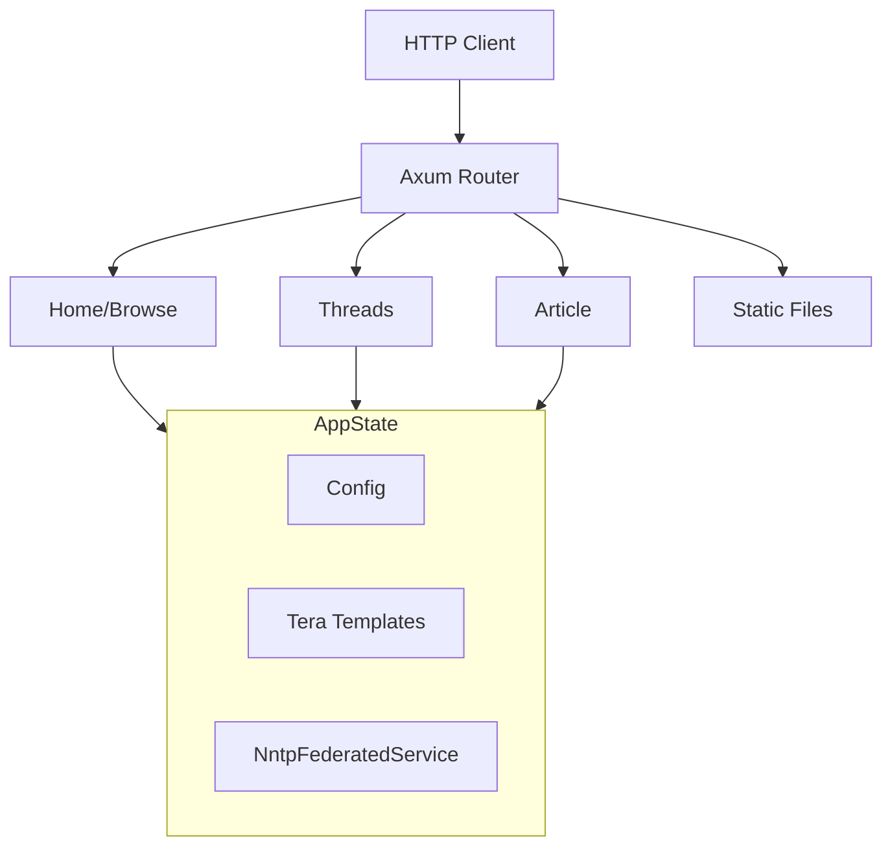
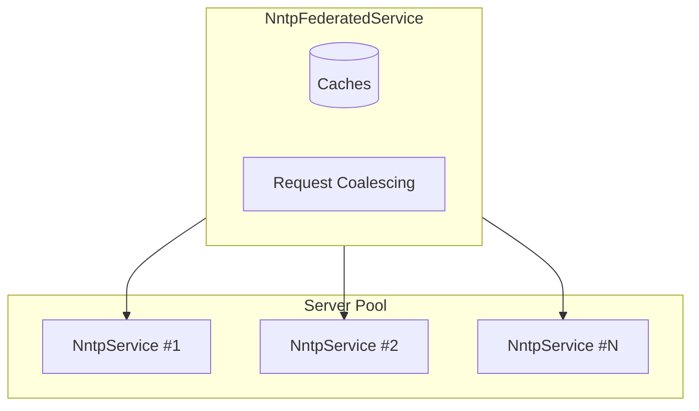
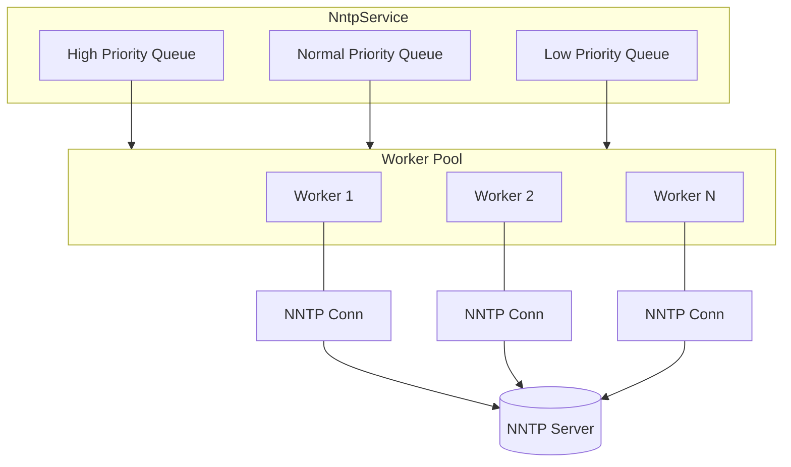

# September Architecture

September is a Rust web application providing a modern web interface to NNTP (Usenet/newsgroup) servers. Built with the Axum framework, it supports multiple NNTP servers with failover, a worker pool architecture with request coalescing, and multi-tier caching.

## Component Architecture

### HTTP Layer and Application State

Routes are defined in `src/routes/mod.rs:22`. Each route group has its own Cache-Control header policy.

### NntpFederatedService

The federated service wraps multiple `NntpService` instances (one per configured server). It handles caching, request coalescing at the federated level, and server selection with failover. Servers are tried in priority order.

### NntpService and Worker Pool

Each `NntpService` manages three priority queues (`async_channel`). Workers check queues in priority order (High → Normal → Low) with aging to prevent starvation. Each worker maintains its own persistent NNTP connection. Worker implementation is in `src/nntp/worker.rs:155`.

**Priority levels:**

| Priority | Operations | Use Case |
|----------|------------|----------|
| **High** | `GetArticle`, `GetThread` | User clicked on content, blocking page render |
| **Normal** | `GetThreads`, `GetGroups` | Page load operations |
| **Low** | `GetGroupStats`, `GetNewArticles` | Background refresh, prefetch |

Priority is determined by `NntpRequest::priority()` (`src/nntp/messages.rs:57-62`). See [NNTP Service](nntp-service.md#request-priority) for details on starvation prevention.

## Module Reference

| Module | Location | Responsibility |
|--------|----------|----------------|
| Entry point | `src/main.rs` | Application bootstrap, server initialization |
| Configuration | `src/config.rs` | TOML config loading, defaults, validation |
| Application state | `src/state.rs:8` | Shared state container (Config, Tera, NntpFederatedService) |
| Error handling | `src/error.rs` | Error types and HTTP response conversion |
| Templates | `src/templates.rs` | Tera template engine initialization |
| Middleware | `src/middleware.rs` | Request ID generation and request span creation |
| Federated service | `src/nntp/federated.rs:41` | Multi-server facade with caching and failover |
| Single-server service | `src/nntp/service.rs:47` | Per-server request handling with coalescing |
| Workers | `src/nntp/worker.rs:141` | NNTP connection management and protocol handling |
| Message types | `src/nntp/messages.rs:37` | Request/response types for worker communication |
| TLS handling | `src/nntp/tls.rs` | TLS stream wrapper for NNTP connections |
| Data types | `src/nntp/mod.rs` | View models, thread tree building, pagination |
| Router | `src/routes/mod.rs:15` | Route registration and cache-control headers |
| Home routes | `src/routes/home.rs` | Group listing and hierarchy browsing |
| Thread routes | `src/routes/threads.rs` | Thread list and thread view handlers |
| Article routes | `src/routes/article.rs` | Single article view handler |

## Data Flow

A typical request flows through the system as follows:

1. **HTTP Request**: Client request arrives at the Axum router (`src/routes/mod.rs:15`)

2. **Route Handler**: Request is dispatched to the appropriate handler (e.g., `threads::list` for `/g/{group}`)

3. **AppState Access**: Handler extracts `AppState` containing the `NntpFederatedService` (`src/state.rs:8`)

4. **Federated Service**: `NntpFederatedService` checks its caches (`src/nntp/federated.rs:46-57`):
   - Article cache, threads cache, thread cache, groups cache, group stats cache
   - Negative cache for not-found articles (short TTL)

5. **Cache Miss**: On cache miss, the federated service selects servers for the group (`src/nntp/federated.rs:153`) and tries them in priority order

6. **NntpService**: The per-server `NntpService` handles request coalescing (`src/nntp/service.rs:34-43`):
   - Checks for in-flight requests for the same resource
   - Coalescing subscribers wait on a broadcast channel
   - New requests are routed to the appropriate priority queue (High/Normal/Low)

7. **Worker Processing**: An `NntpWorker` pulls requests from priority queues (`src/nntp/worker.rs:361`):
   - Checks High → Normal → Low priority queues in order
   - Implements aging to prevent starvation of low-priority requests
   - Maintains persistent NNTP connection with auto-reconnect
   - Executes the NNTP protocol commands (OVER, HDR, ARTICLE, etc.)
   - Handles TLS negotiation and authentication

8. **Response Propagation**: Results flow back through the layers:
   - Worker sends response via oneshot channel
   - NntpService broadcasts to coalesced waiters and returns
   - NntpFederatedService caches successful results
   - Handler renders the Tera template with the data

9. **HTTP Response**: Axum sends the response with appropriate Cache-Control headers set per route group (`src/routes/mod.rs:17-55`)

## Key Design Decisions

**Federated Model**: Multiple NNTP servers are treated as a federated pool sharing the same Usenet backbone. Requests try servers in priority order with automatic failover. Group lists are merged from all servers (`src/nntp/federated.rs:606-673`).

**Request Coalescing**: Duplicate requests for the same resource are coalesced at both the service level (`src/nntp/service.rs:114-131`) and federated level (`src/nntp/federated.rs:686-720`), preventing thundering herd problems.

**Priority Scheduling**: Requests are assigned priorities (High/Normal/Low) based on latency sensitivity. User-facing operations like article fetches are High priority, while background tasks like group stats are Low priority. Workers process higher-priority requests first, with aging to prevent starvation (`src/nntp/worker.rs:178-236`).

**Worker Pool**: Each server has its own pool of workers with persistent connections. Workers check three priority queues in order, providing both load balancing and responsive scheduling (`src/nntp/worker.rs:155-170`).

**Incremental Updates**: Thread caches store a high water mark (last article number). Cache hits trigger incremental fetches for new articles only (`src/nntp/federated.rs:262-314`). See [Background Refresh](background-refresh.md) for the activity-proportional refresh system.

**Negative Caching**: Not-found articles are cached with a short TTL to avoid repeated lookups for missing content (`src/nntp/federated.rs:121-124`, `src/nntp/federated.rs:194-197`).
