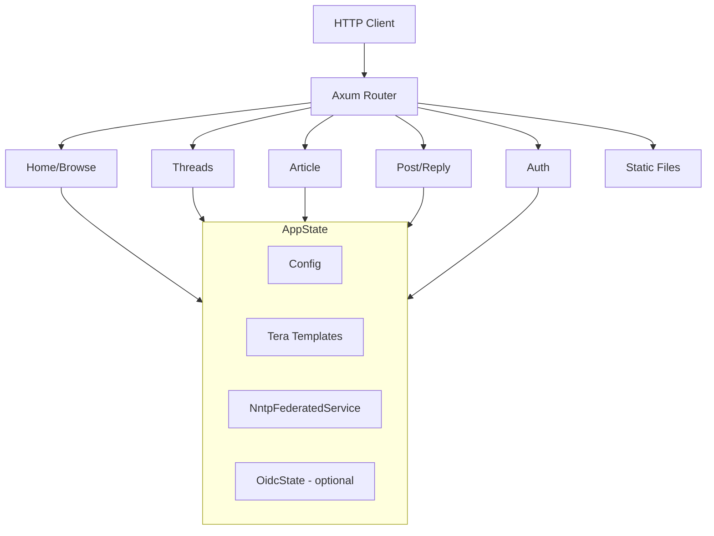
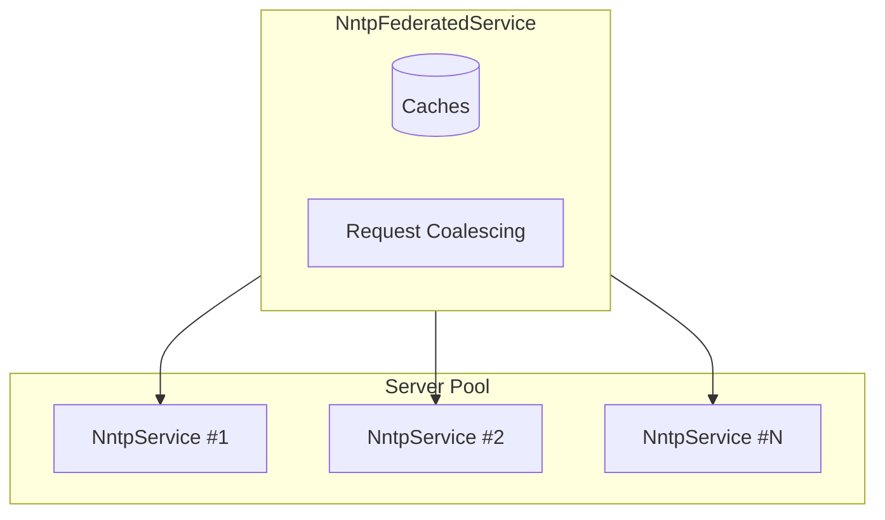
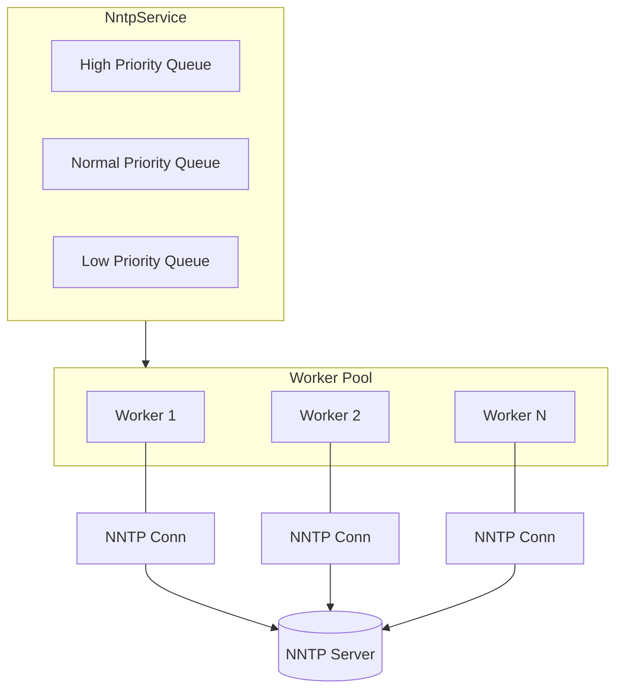

# Component Architecture

This document provides detailed component diagrams and module reference for September's internal architecture.

For a high-level system overview, see [ARCHITECTURE.md](../ARCHITECTURE.md) in the project root.

September is a Rust web application providing a modern web interface to NNTP (Usenet/newsgroup) servers. Built with the Axum framework, it supports multiple NNTP servers with failover, a worker pool architecture with request coalescing, and multi-tier caching.

## High Level Design

We want September to be a well-behaved client towards it's NNTP servers. 
This means we want to minimize the load we place on those servers through smart caching and batching requests into a minimum number of NNTP operations.

We are designing for the use case where we may have thousands of users primarily reading content. 
Instead of directly operating on NNTP primtives, we go through a layer of indirection where clients submit higher level requests,
such as retrieving all threads in a group, and the underlying NNTP clients take these requests and translate them into operations based on the server capabilities.

We also want September to minimize the latency between when an article is posted to a server and when it becomes visible to our users. This is to enable soft real-time conversations instead of something fully asyncronous.
This is built through use of fine-grained cache TTLs and preemptivly fetching new articles in active groups.

## Component Architecture

### HTTP Layer and Application State

Routes are defined in `src/routes/mod.rs` (`create_router`). Each route group has its own Cache-Control header policy.

### NntpFederatedService

The federated service wraps multiple `NntpService` instances (one per configured server). It handles caching, request coalescing at the federated level, and server selection with failover. Servers are tried in priority order.

### NntpService and Worker Pool

Each `NntpService` manages three priority queues (`async_channel`). Workers check queues in priority order (High → Normal → Low) with aging to prevent starvation. Each worker maintains its own persistent NNTP connection. Worker implementation is in `src/nntp/worker.rs` (`NntpWorker`).

**Priority levels:**

| Priority | Operations | Use Case |
|----------|------------|----------|
| **High** | `GetArticle`, `PostArticle`, `CheckArticleExists` | User clicked on content or posted, blocking page render |
| **Normal** | `GetThreads`, `GetGroups` | Page load operations |
| **Low** | `GetGroupStats`, `GetNewArticles` | Background refresh, prefetch |

Priority is determined by `NntpRequest::priority()` in `src/nntp/messages.rs`. See [NNTP Service](nntp-service.md#request-priority) for details on starvation prevention.

## Module Reference

| Module | Location | Responsibility |
|--------|----------|----------------|
| Entry point | `src/main.rs` | Application bootstrap, server initialization |
| Configuration | `src/config.rs` | TOML config loading, defaults, validation |
| Application state | `src/state.rs` (`AppState`) | Shared state container (Config, Tera, NntpFederatedService) |
| Error handling | `src/error.rs` | Error types and HTTP response conversion |
| Templates | `src/templates.rs` | Tera template engine initialization |
| Middleware | `src/middleware.rs` | Request ID generation, authentication extractors, session handling |
| Federated service | `src/nntp/federated.rs` (`NntpFederatedService`) | Multi-server facade with caching and failover |
| Single-server service | `src/nntp/service.rs` (`NntpService`) | Per-server request handling with coalescing |
| Workers | `src/nntp/worker.rs` (`NntpWorker`) | NNTP connection management and protocol handling |
| Message types | `src/nntp/messages.rs` (`NntpRequest`, `NntpResponse`) | Request/response types for worker communication |
| TLS handling | `src/nntp/tls.rs` (`NntpStream`) | TLS stream wrapper for NNTP connections |
| Data types | `src/nntp/mod.rs` | View models, thread tree building, pagination |
| Router | `src/routes/mod.rs` (`create_router`) | Route registration, cache-control headers, auth helpers |
| Home routes | `src/routes/home.rs` (`index`, `browse`) | Group listing and hierarchy browsing |
| Thread routes | `src/routes/threads.rs` (`list`, `view`) | Thread list and thread view handlers |
| Article routes | `src/routes/article.rs` (`view`) | Single article view handler |
| Post routes | `src/routes/post.rs` (`compose`, `submit`, `reply`) | New post and reply handlers |
| Auth routes | `src/routes/auth.rs` (`login`, `callback`, `logout`) | OIDC authentication flow handlers |
| Privacy routes | `src/routes/privacy.rs` (`privacy`) | Privacy policy page |
| Health routes | `src/routes/health.rs` (`health`) | Health check endpoint for liveness probes |
| OIDC module | `src/oidc/mod.rs` | OpenID Connect client and provider management |
| Session handling | `src/oidc/session.rs` | User session data, CSRF tokens, cookie management |

## Data Flow

A typical request flows through the system as follows:

1. **HTTP Request**: Client request arrives at the Axum router (`create_router` in `src/routes/mod.rs`)

2. **Route Handler**: Request is dispatched to the appropriate handler (e.g., `threads::list` for `/g/{group}`)

3. **AppState Access**: Handler extracts `AppState` containing the `NntpFederatedService`

4. **Federated Service**: `NntpFederatedService` checks its caches:
   - Article cache, threads cache, thread cache, groups cache, group stats cache
   - Negative cache for not-found articles (short TTL)

5. **Cache Miss**: On cache miss, the federated service selects servers for the group (`get_servers_for_group`) and tries them in priority order

6. **NntpService**: The per-server `NntpService` handles request coalescing via `PendingRequests`:
   - Checks for in-flight requests for the same resource
   - Coalescing subscribers wait on a broadcast channel
   - New requests are routed to the appropriate priority queue (High/Normal/Low)

7. **Worker Processing**: An `NntpWorker` pulls requests via `recv_prioritized`:
   - Checks High → Normal → Low priority queues in order
   - Implements aging to prevent starvation of low-priority requests
   - Maintains persistent NNTP connection with auto-reconnect
   - Executes the NNTP protocol commands (OVER, HDR, ARTICLE, etc.)
   - Handles TLS negotiation and authentication

8. **Response Propagation**: Results flow back through the layers:
   - Worker sends response via oneshot channel
   - NntpService broadcasts to coalesced waiters and returns
   - NntpFederatedService caches successful results
   - Handler renders the Tera template with the data

9. **HTTP Response**: Axum sends the response with appropriate Cache-Control headers set per route group

## Key Design Decisions

**Federated Model**: Multiple NNTP servers are treated as a federated pool sharing the same Usenet backbone. Requests try servers in priority order with automatic failover. Group lists are merged from all servers (`NntpFederatedService::get_groups`).

**Request Coalescing**: Duplicate requests for the same resource are coalesced at both the service level (`NntpService::get_article`, etc.) and federated level (`NntpFederatedService::get_group_stats`), preventing thundering herd problems.

**Priority Scheduling**: Requests are assigned priorities (High/Normal/Low) based on latency sensitivity. User-facing operations like article fetches are High priority, while background tasks like group stats are Low priority. Workers process higher-priority requests first, with aging to prevent starvation (`NntpWorker::recv_prioritized`).

**Worker Pool**: Each server has its own pool of workers with persistent connections. Workers check three priority queues in order, providing both load balancing and responsive scheduling.

**Incremental Updates**: Thread caches store a high water mark (last article number). Cache hits trigger incremental fetches for new articles only (`get_new_articles_coalesced`). See [Background Refresh](background-refresh.md) for the activity-proportional refresh system.

**Negative Caching**: Not-found articles are cached with a short TTL to avoid repeated lookups for missing content (`article_not_found_cache`).
