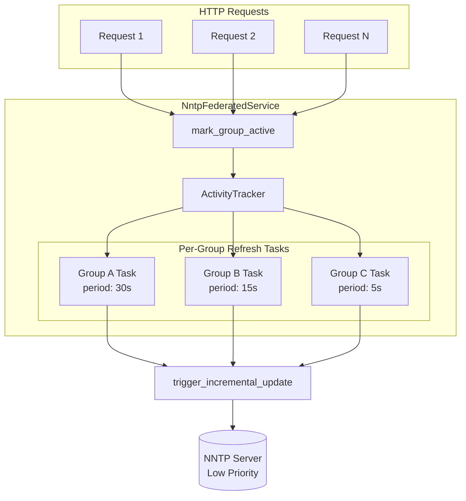
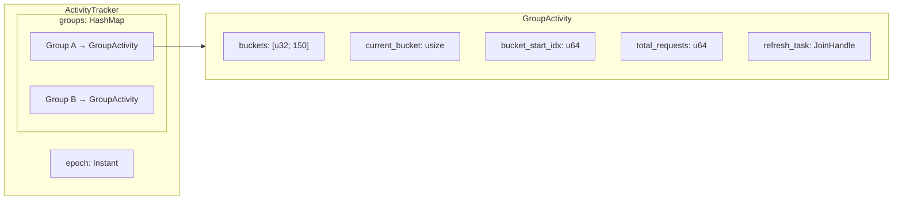
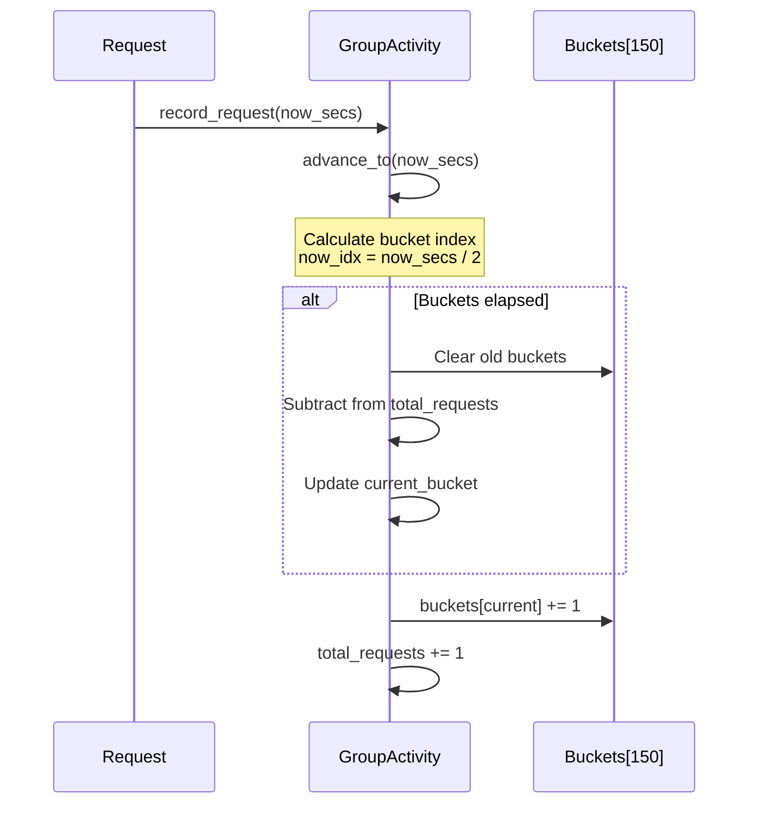
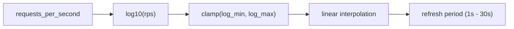
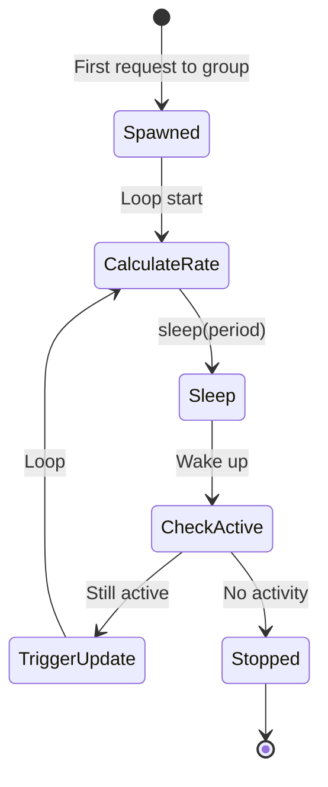
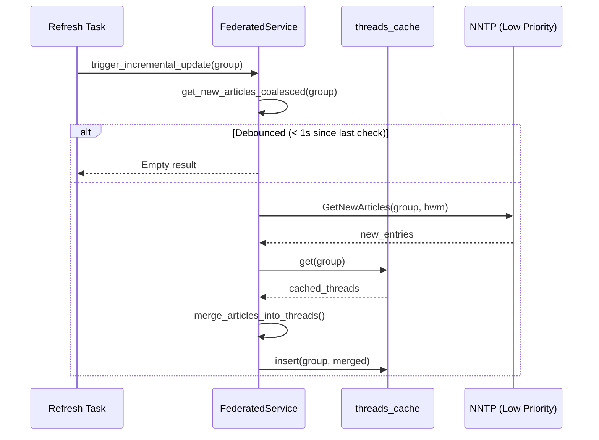

# Background Refresh System

This document describes September's activity-proportional background refresh system, which keeps cached thread data fresh by periodically fetching new articles based on user activity levels.

## Overview

The background refresh system ensures that active newsgroups have near-real-time updates while minimizing server load for inactive groups. Refresh frequency scales logarithmically with request rate:

- **High activity** (10,000 requests/second): Refresh every 1 second
- **Low activity** (any requests in 5 minutes): Refresh every 30 seconds
- **No activity**: No background refresh (task stops)

## Architecture



## Activity Tracking

Activity is tracked per-group using a circular buffer that maintains a 5-minute moving average of requests.

### Data Structures



**Configuration constants** (`src/config.rs`):

| Constant | Default | Description |
|----------|---------|-------------|
| `ACTIVITY_WINDOW_SECS` | 300 | Moving average window (5 minutes) |
| `ACTIVITY_BUCKET_COUNT` | 150 | Number of buckets in circular buffer |
| `BACKGROUND_REFRESH_MIN_PERIOD_SECS` | 1 | Refresh period at maximum activity |
| `BACKGROUND_REFRESH_MAX_PERIOD_SECS` | 30 | Refresh period at minimum activity |
| `ACTIVITY_HIGH_RPS` | 10,000 | Request rate threshold for minimum period |

**Bucket granularity**: `ACTIVITY_WINDOW_SECS / ACTIVITY_BUCKET_COUNT` = 2 seconds per bucket

### Circular Buffer Operation



When time advances, expired buckets are cleared and their counts subtracted from the running total. This allows O(1) calculation of requests per second without iterating all buckets.

## Refresh Period Calculation

The refresh period uses logarithmic scaling to provide responsive updates for busy groups while being gentle on quiet ones.



**Formula** (`src/nntp/federated.rs:calculate_refresh_period`):

```
log_min = log10(1/300) ≈ -2.48  (1 request in 5 minutes)
log_max = log10(10000) = 4.0    (10k requests/second)

ratio = (log10(rps) - log_min) / (log_max - log_min)
period = 30s - ratio * (30s - 1s)
```

**Example periods**:

| Requests/sec | log10(rps) | Ratio | Period |
|-------------|-----------|-------|--------|
| 10,000 | 4.0 | 1.0 | 1s |
| 1,000 | 3.0 | 0.85 | 5.4s |
| 100 | 2.0 | 0.69 | 10s |
| 10 | 1.0 | 0.54 | 14s |
| 1 | 0.0 | 0.38 | 19s |
| 0.1 | -1.0 | 0.23 | 23s |
| 0.01 | -2.0 | 0.07 | 28s |
| 0.003 | -2.48 | 0.0 | 30s |

## Per-Group Refresh Tasks

Each active group has its own background task that:

1. Calculates current request rate from the activity tracker
2. Computes the appropriate refresh period
3. Sleeps for that period
4. Checks if the group is still active
5. Triggers an incremental update if active
6. Loops back to step 1



**Task lifecycle** (`src/nntp/federated.rs:spawn_group_refresh_task`):

- **Spawn**: When `mark_group_active()` is called and no task exists for the group
- **Run**: Continuously while the group has activity within the 5-minute window
- **Stop**: When `active_groups()` no longer includes the group (no requests in 5 minutes)

Tasks are stored in `GroupActivity.refresh_task` and aborted if a new task needs to be spawned.

## Incremental Updates

When a refresh task triggers, it calls `trigger_incremental_update()` which:

1. Fetches new articles since the cached high water mark via `get_new_articles_coalesced()`
2. Merges new articles into the cached thread list
3. Updates the cache with the merged result



### Request Coalescing

Incremental update requests are coalesced at the federated level (`src/nntp/federated.rs:get_new_articles_coalesced`):

- Multiple concurrent requests for the same group share a single NNTP request
- Requests are debounced (max 1 check per second per group via `INCREMENTAL_DEBOUNCE_MS`)
- Uses broadcast channels to notify all waiters of the result

### Priority

All background refresh operations use `Priority::Low` (`src/nntp/messages.rs:109`), ensuring they never block user-facing requests.

## Integration Points

**Startup** (`src/main.rs`):
```rust
Arc::new(nntp_service.clone()).spawn_background_refresh();
```

**On user request** (`src/nntp/federated.rs:get_threads`, `get_thread`):
```rust
self.mark_group_active(group).await;
```

**Cache updates**: Both `get_threads()` and `get_thread()` perform incremental updates on cache hits, in addition to the background refresh tasks.

## Monitoring

Debug-level log messages show refresh activity:

```
DEBUG group=comp.lang.rust "Spawning background refresh task"
DEBUG group=comp.lang.rust rps=0.50 period_secs=22.5 "Group refresh scheduled"
DEBUG group=comp.lang.rust "Triggering incremental update"
DEBUG group=comp.lang.rust count=3 "Found new articles"
DEBUG group=comp.lang.rust "Group inactive, stopping refresh task"
```

Set `RUST_LOG=september=debug` to see these messages.
