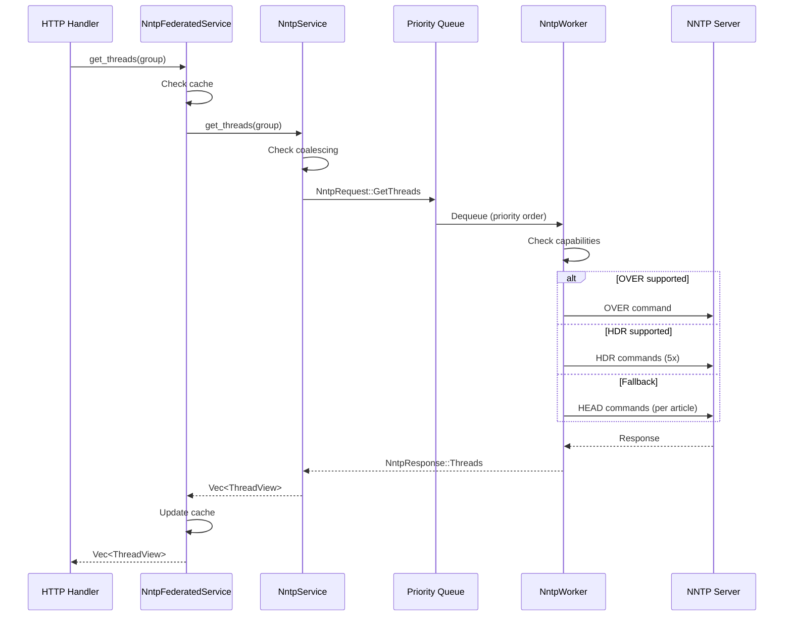

# Extending NNTP Actions

Guide for adding new high-level NNTP actions to September. Actions are abstract operations (like "get threads" or "post article") that get translated into concrete NNTP protocol commands based on server capabilities.

## Architecture Overview



## Step-by-Step Guide

### Step 1: Add NntpRequest Variant

In `src/nntp/messages.rs`, add a new variant to the `NntpRequest` enum:

```rust
pub enum NntpRequest {
    // ... existing variants ...
    
    /// Your new action description
    GetSomething {
        /// Parameters needed for the request
        group: String,
        /// Response channel - always include this
        response: oneshot::Sender<Result<YourResponseType, NntpError>>,
    },
}
```

Key points:
- Include a `response` field with `oneshot::Sender<Result<T, NntpError>>`
- Document the purpose of each field
- Parameters should be owned types (not references)

### Step 2: Add NntpResponse Variant

In the same file, add a corresponding response variant:

```rust
pub enum NntpResponse {
    // ... existing variants ...
    
    Something(YourResponseType),
}
```

### Step 3: Implement priority() Match Arm

Add a match arm to `NntpRequest::priority()`:

```rust
pub fn priority(&self) -> Priority {
    match self {
        // ... existing arms ...
        
        // Choose priority based on latency sensitivity:
        // - High: User is waiting (GetArticle, PostArticle)
        // - Normal: Page load operations (GetThreads, GetGroups)
        // - Low: Background operations (GetGroupStats, GetNewArticles)
        NntpRequest::GetSomething { .. } => Priority::Normal,
    }
}
```

### Step 4: Implement respond() Match Arm

Add a match arm to `NntpRequest::respond()`:

```rust
pub fn respond(self, result: Result<NntpResponse, NntpError>) {
    match self {
        // ... existing arms ...
        
        NntpRequest::GetSomething { response, .. } => {
            if let Ok(NntpResponse::Something(data)) = result {
                let _ = response.send(Ok(data));
            } else if let Err(e) = result {
                let _ = response.send(Err(e));
            }
        }
    }
}
```

### Step 5: Add Public Method in NntpService

In `src/nntp/service.rs`, add a public method:

```rust
/// Fetch something from the newsgroup
#[instrument(
    name = "nntp.service.get_something",
    skip(self),
    fields(server = %self.name, coalesced = false, duration_ms)
)]
pub async fn get_something(&self, group: &str) -> Result<YourResponseType, NntpError> {
    let start = Instant::now();
    
    // For coalescing (optional - see "Request Coalescing" section below)
    // ...
    
    let (resp_tx, resp_rx) = oneshot::channel();
    self.send_request(NntpRequest::GetSomething {
        group: group.to_string(),
        response: resp_tx,
    })
    .await?;

    // Wait for result with timeout
    let result = match tokio::time::timeout(self.request_timeout, resp_rx).await {
        Ok(Ok(result)) => result,
        Ok(Err(_)) => Err(NntpError("Worker dropped request".into())),
        Err(_) => Err(NntpError("Request timeout".into())),
    };

    tracing::Span::current().record("duration_ms", start.elapsed().as_millis() as u64);
    result
}
```

### Step 6: Add Worker Handler

In `src/nntp/worker.rs`, add a match arm to `handle_request_inner()`:

```rust
async fn handle_request_inner(
    &self,
    client: &mut NntpClient<NntpStream>,
    request: &NntpRequest,
    capabilities: &ServerCapabilities,
) -> Result<NntpResponse, NntpError> {
    match request {
        // ... existing arms ...
        
        NntpRequest::GetSomething { group, .. } => {
            Span::current().record("operation", "get_something");
            tracing::debug!(%group, "Fetching something");
            
            // Capability-aware implementation
            let result = if capabilities.some_feature_supported {
                // Preferred method
                client.efficient_command(group).await
            } else {
                // Fallback method
                client.fallback_command(group).await
            };
            
            let data = result.map_err(|e| NntpError(e.to_string()))?;
            Ok(NntpResponse::Something(data))
        }
    }
}
```

### Step 7: Add Caching (Optional)

In `src/nntp/federated.rs`, add cache and public method:

```rust
// In NntpFederatedService struct:
something_cache: Cache<String, YourResponseType>,

// In new():
something_cache: Cache::builder()
    .max_capacity(cache_config.max_something as u64)
    .time_to_live(Duration::from_secs(cache_config.something_ttl_seconds))
    .build(),

// Public method:
pub async fn get_something(&self, group: &str) -> Result<YourResponseType, AppError> {
    // Check cache first
    if let Some(cached) = self.something_cache.get(group).await {
        return Ok(cached);
    }
    
    // Try servers in order
    for service in &self.services {
        match service.get_something(group).await {
            Ok(result) => {
                self.something_cache.insert(group.to_string(), result.clone()).await;
                return Ok(result);
            }
            Err(e) => {
                tracing::warn!(server = %service.name(), error = %e, "Server failed, trying next");
            }
        }
    }
    
    Err(AppError::NntpError("All servers failed".into()))
}
```

## Capability-Aware Dispatch

The `ServerCapabilities` struct in `worker.rs` tracks what NNTP commands the server supports:

```rust
struct ServerCapabilities {
    hdr_supported: bool,           // HDR command available
    over_supported: bool,          // OVER/XOVER command available
    references_in_overview: bool,  // References field in OVER format
    post_supported: bool,          // POST command in CAPABILITIES
    greeting_allows_post: bool,    // Greeting/MODE READER allows posting
    list_variants: HashSet<String>, // Supported LIST variants
    retrieved: bool,               // Were capabilities successfully fetched
}
```

### Pattern: Graceful Degradation

```rust
let method = capabilities.thread_fetch_method();
match method {
    ThreadFetchMethod::Over => {
        // Best: 1 round-trip, all data in overview
        client.over(range).await
    }
    ThreadFetchMethod::Hdr => {
        // Good: 5 round-trips (one per header field)
        self.fetch_threads_via_hdr(client, &range).await
    }
    ThreadFetchMethod::Head => {
        // Fallback: N round-trips (one per article)
        self.fetch_threads_via_head(client, start, end).await
    }
}
```

### Adding New Capabilities

If your action requires detecting new server capabilities:

1. Add field to `ServerCapabilities`:
   ```rust
   my_feature_supported: bool,
   ```

2. Parse in `from_capabilities()`:
   ```rust
   } else if cap_upper == "MYFEATURE" {
       my_feature_supported = true;
   }
   ```

3. Add helper method if needed:
   ```rust
   fn supports_my_feature(&self) -> bool {
       self.my_feature_supported && self.some_other_condition
   }
   ```

## Request Coalescing

For actions where multiple callers might request the same data simultaneously, implement coalescing to avoid redundant NNTP requests.

### When to Use Coalescing

- **Use coalescing**: Actions with stable keys (article ID, group name)
- **Skip coalescing**: Actions with dynamic parameters (article number ranges)

### Coalescing Pattern

```rust
// In PendingRequests struct:
something: Mutex<HashMap<String, PendingEntry<YourResponseType>>>,

// In get_something():
let mut pending = self.pending.something.lock().await;
if let Some((tx, started_at)) = pending.get(&cache_key) {
    if started_at.elapsed() < self.request_timeout {
        // Coalesce: wait for existing request
        let mut rx = tx.subscribe();
        drop(pending);
        tracing::Span::current().record("coalesced", true);
        return match tokio::time::timeout(self.request_timeout, rx.recv()).await {
            Ok(Ok(result)) => result,
            Ok(Err(_)) => Err(NntpError("Broadcast channel closed".into())),
            Err(_) => Err(NntpError("Request timeout".into())),
        };
    }
}

// Register new pending request
let (tx, _) = broadcast::channel(BROADCAST_CHANNEL_CAPACITY);
pending.insert(cache_key.clone(), (tx.clone(), Instant::now()));
drop(pending);

// ... send request and wait for response ...

// Broadcast result to all waiters
self.pending.something.lock().await.remove(&cache_key);
let _ = tx.send(result.clone());
```

## Example: GetGroupStats

A complete example of a simpler action:

### messages.rs

```rust
// Request variant
GetGroupStats {
    group: String,
    response: oneshot::Sender<Result<GroupStatsView, NntpError>>,
},

// Response variant
GroupStats(GroupStatsView),

// Priority (background operation)
NntpRequest::GetGroupStats { .. } => Priority::Low,

// Respond
NntpRequest::GetGroupStats { response, .. } => {
    if let Ok(NntpResponse::GroupStats(stats)) = result {
        let _ = response.send(Ok(stats));
    } else if let Err(e) = result {
        let _ = response.send(Err(e));
    }
}
```

### worker.rs

```rust
NntpRequest::GetGroupStats { group, .. } => {
    Span::current().record("operation", "get_group_stats");
    
    let stats = client.group(group).await
        .map_err(|e| NntpError(e.to_string()))?;
    
    // Get date of last article using capability-aware approach
    let last_article_date = if stats.last > 0 {
        match client.hdr("Date".to_string(), Some(stats.last.to_string())).await {
            Ok(headers) => headers.first().map(|h| h.value.clone()),
            Err(_) => {
                // Fallback to HEAD command
                match client.head(ArticleSpec::number_in_group(group, stats.last)).await {
                    Ok(raw) => parse_date_header(&raw),
                    Err(_) => None,
                }
            }
        }
    } else {
        None
    };
    
    Ok(NntpResponse::GroupStats(GroupStatsView {
        last_article_date,
        last_article_number: stats.last,
    }))
}
```

## Testing

### Unit Tests (messages.rs)

```rust
#[test]
fn test_priority_get_something_is_normal() {
    let (tx, _rx) = oneshot::channel();
    let req = NntpRequest::GetSomething {
        group: "test.group".to_string(),
        response: tx,
    };
    assert_eq!(req.priority(), Priority::Normal);
}
```

### Integration Tests

Add to `tests/integration/test_observability.py`:

```python
def test_something_logged(september_logs):
    """Given something fetch, when logs checked, then shows operation."""
    # Trigger the action via HTTP
    response = requests.get(f"{BASE_URL}/something/test.group")
    
    # Check logs for expected operation
    assert_log_contains(september_logs, "operation", "get_something")
```

## Checklist

When adding a new NNTP action, ensure you've updated:

- [ ] `src/nntp/messages.rs`
  - [ ] `NntpRequest` variant with response channel
  - [ ] `NntpResponse` variant
  - [ ] `priority()` match arm
  - [ ] `respond()` match arm
  - [ ] Unit test for priority
- [ ] `src/nntp/service.rs`
  - [ ] Public async method with tracing
  - [ ] Coalescing (if applicable)
- [ ] `src/nntp/worker.rs`
  - [ ] `handle_request_inner()` match arm
  - [ ] Capability-aware dispatch (if applicable)
- [ ] `src/nntp/federated.rs` (if caching needed)
  - [ ] Cache field
  - [ ] Cache initialization
  - [ ] Public method with cache check
- [ ] `features.yml`
  - [ ] Requirements for the new action
  - [ ] Test case references
- [ ] Tests
  - [ ] Unit tests for priority
  - [ ] Integration tests for end-to-end flow

## Related Documentation

- [NNTP Service](nntp-service.md) - Worker pool architecture and priority queues
- [Component Architecture](architecture.md) - Overall system design
- [Background Refresh](background-refresh.md) - Activity tracking and incremental updates
