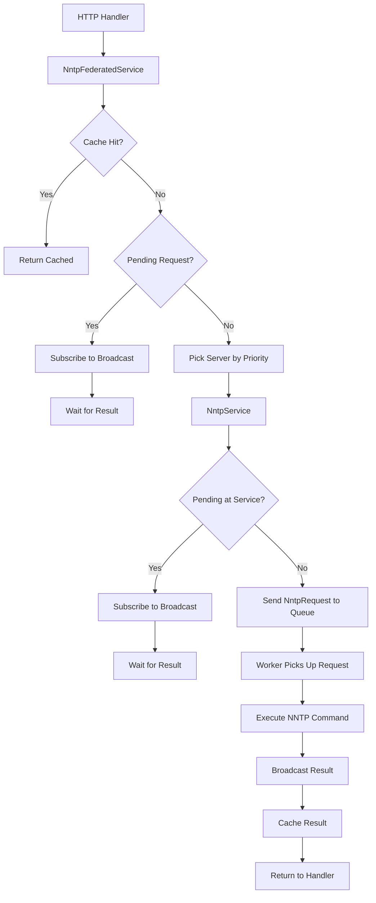
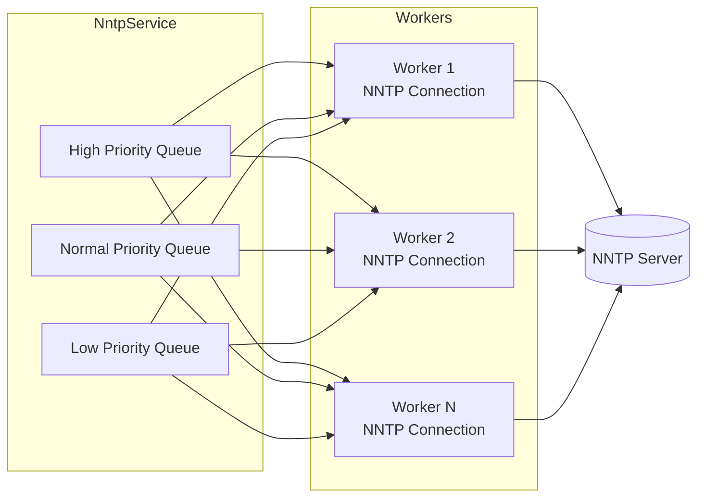

# NNTP Service Architecture

This document describes September's NNTP service layer, which provides a federated, cached interface to multiple NNTP servers.

## Overview

The service layer has three main components:

1. **NntpFederatedService** (`src/nntp/federated.rs`) - Unified interface over multiple servers with caching
2. **NntpService** (`src/nntp/service.rs`) - Single-server communication with request coalescing
3. **NntpWorker** (`src/nntp/worker.rs`) - Persistent NNTP connections that process requests

## Request Flow

## Worker Pool Architecture

Each `NntpService` creates three bounded `async_channel` queues for priority-based scheduling. Workers check queues in priority order (High → Normal → Low) and maintain persistent NNTP connections.

## Request Priority

Requests are prioritized to ensure user-facing operations are processed before background tasks:

| Priority | Operations | Use Case |
|----------|------------|----------|
| **High** | `GetArticle`, `GetThread` | User clicked on content, blocking page render |
| **Normal** | `GetThreads`, `GetGroups` | Page load operations |
| **Low** | `GetGroupStats`, `GetNewArticles` | Background refresh, prefetch |

Priority is determined by `NntpRequest::priority()` in `src/nntp/messages.rs`.

### Starvation Prevention (Aging)

To prevent low-priority requests from waiting indefinitely under sustained load, workers implement aging:

- Each worker tracks when it last processed a low-priority request
- If more than `NNTP_PRIORITY_AGING_SECS` (default: 10s) have passed, one low-priority request is processed
- This ensures background tasks eventually complete even during high load

Configuration constants are in `src/config.rs`.

## Caching Strategy

Caching is handled at the `NntpFederatedService` level using [moka](https://github.com/moka-rs/moka) async caches.

| Cache | Key Format | Default TTL | Purpose |
|-------|-----------|-------------|---------|
| `article_cache` | `message_id` | 24h (configurable) | Individual article content |
| `article_not_found_cache` | `message_id` | 60s | Negative cache for missing articles |
| `threads_cache` | `group` | 5min (configurable) | Thread lists with high water mark |
| `thread_cache` | `group:message_id` | 5min (configurable) | Individual thread metadata |
| `groups_cache` | `"groups"` | 1h (configurable) | Merged group list from all servers |
| `group_stats_cache` | `group` | 5min (configurable) | Article count and last article date |

Cache configuration is defined in `config/default.toml` under `[cache]`.

### Incremental Thread Updates

The `threads_cache` stores a `CachedThreads` struct containing both the thread list and a high water mark (last article number). On cache hit, the service fetches only new articles since the high water mark and merges them into the cached threads.

## Request Coalescing

Request coalescing prevents duplicate NNTP requests when multiple handlers request the same resource simultaneously.

**How it works:**

1. When a request arrives, the service checks a `pending` map keyed by request identifier
2. If a matching request is in-flight, the caller subscribes to its `broadcast::Sender` and waits
3. If no pending request exists, a new broadcast channel is created and registered
4. The request is sent to the worker queue
5. When the worker responds, the result is broadcast to all waiting subscribers
6. The pending entry is removed

Coalescing occurs at two levels:
- **NntpFederatedService**: Coalesces `group_stats` and incremental update requests across all servers
- **NntpService**: Coalesces all request types per-server via `PendingRequests`

Pending requests include a timestamp and are considered expired after the configured request timeout.

## TLS Connection Handling

The `NntpStream` type in `src/nntp/tls.rs` provides a unified interface for TLS and plain TCP connections.

**Connection strategy:**

1. Attempt TLS connection first using system root certificates
2. If credentials are configured, TLS is **required** (no fallback)
3. If no credentials, fall back to plain TCP on TLS failure

This is controlled via thread-local state set by the worker before connecting. The connection type is logged for debugging.

## Message Types

Request/response types are defined in `src/nntp/messages.rs`:

- `Priority` enum: `High`, `Normal`, `Low` - determines scheduling order
- `NntpRequest` enum: `GetArticle`, `GetThreads`, `GetThread`, `GetGroups`, `GetGroupStats`, `GetNewArticles`
- `NntpResponse` enum: Corresponding response variants
- `NntpError`: Wrapper for error messages that can be sent across channels

Each request type has an associated priority via `NntpRequest::priority()`. Responses are returned via `oneshot::Sender` channels embedded in each request variant.

## Server Capability Detection

Workers detect server capabilities on connection via the CAPABILITIES command:

- **HDR**: Efficient per-header fetching
- **OVER**: Overview format with multiple headers
- **LIST variants**: ACTIVE, NEWSGROUPS, OVERVIEW.FMT

The `ThreadFetchMethod` enum is selected based on capabilities:
1. HDR (preferred) - fetches each header field separately
2. OVER - fetches overview entries with References
3. HEAD (fallback) - fetches full headers per article

## Background Refresh

The service implements activity-proportional background refresh for thread caches. Rather than fixed-interval polling, each group's refresh rate scales with request activity.

See [Background Refresh](background-refresh.md) for full details on:
- Activity tracking with circular buffers
- Log-scale refresh period calculation (1-30 seconds based on activity)
- Per-group task lifecycle
- Request coalescing for background fetches
