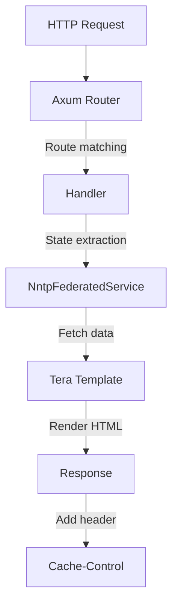

# HTTP Routing and Caching

September uses [Axum](https://github.com/tokio-rs/axum) for HTTP routing with per-route Cache-Control headers based on content mutability.

## Route Table

| Path | Handler | Cache-Control | Description |
|------|---------|---------------|-------------|
| `/` | `home::index` | `public, max-age=300` | Homepage |
| `/browse/{*prefix}` | `home::browse` | `public, max-age=300` | Browse newsgroups by prefix |
| `/g/{group}` | `threads::list` | `public, max-age=120` | Thread list for a newsgroup |
| `/g/{group}/thread/{message_id}` | `threads::view` | `public, max-age=300` | View thread with replies |
| `/a/{message_id}` | `article::view` | `public, max-age=86400` | View individual article |
| `/static/*` | `ServeDir` | `public, max-age=31536000, immutable` | Static assets (CSS, JS) |

## Request Flow

## Code Locations

- Router creation: `src/routes/mod.rs:15` (`create_router`)
- Home handlers: `src/routes/home.rs:47` (`index`), `src/routes/home.rs:83` (`browse`)
- Thread handlers: `src/routes/threads.rs:15` (`list`), `src/routes/threads.rs:60` (`view`)
- Article handler: `src/routes/article.rs` (`view`)
- Cache constants: `src/config.rs`

## Cache Strategy Rationale

Cache durations are based on content mutability:

| Content Type | TTL | Rationale |
|--------------|-----|-----------|
| Articles | 1 day | Immutable once posted; content never changes |
| Thread views | 5 min | May receive new replies; balance freshness with load |
| Thread lists | 2 min | New threads appear frequently; shorter cache |
| Home/browse | 5 min | Moderate activity; acceptable staleness |
| Static files | 1 year | Immutable flag; fingerprint URLs for cache busting |
| Errors | no-cache | Transient; should not be cached |

The strategy prioritizes cacheability for immutable content (articles, static assets) while allowing dynamic content (thread lists) to update more frequently. This reduces load on the NNTP backend while maintaining acceptable freshness for active discussions.
