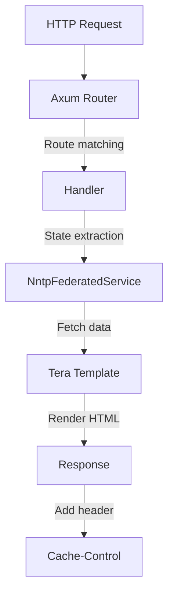

# HTTP Routing and Caching

September uses [Axum](https://github.com/tokio-rs/axum) for HTTP routing with per-route Cache-Control headers based on content mutability.

## Route Table

| Path | Handler | Description |
|------|---------|-------------|
| `/` | `home::index` | Homepage |
| `/browse/{*prefix}` | `home::browse` | Browse newsgroups by prefix |
| `/g/{group}` | `threads::list` | Thread list for a newsgroup |
| `/g/{group}/thread/{message_id}` | `threads::view` | View thread with replies |
| `/a/{message_id}` | `article::view` | View individual article |
| `/static/*` | `ServeDir` | Static assets (CSS, JS) |

## Request Flow

## Code Locations

- Router creation: `src/routes/mod.rs` (`create_router`)
- Home handlers: `src/routes/home.rs` (`index`, `browse`)
- Thread handlers: `src/routes/threads.rs` (`list`, `view`)
- Article handler: `src/routes/article.rs` (`view`)
- Cache constants: `src/config.rs`

## Cache Strategy

All Cache-Control headers include `stale-while-revalidate` (SWR) and `stale-if-error` directives for CDN resilience. The SWR directive allows serving stale content while fetching fresh data in the background, and `stale-if-error` provides thundering herd protection during backend failures.

| Content Type | max-age | stale-while-revalidate | Rationale |
|--------------|---------|------------------------|-----------|
| Articles | 1 hour | 60s | Immutable once posted; long cache safe |
| Thread views | 2s | 5s | May receive new replies; aggressive revalidation |
| Thread lists | 2s | 5s | New threads appear frequently; aggressive revalidation |
| Home/browse | 60s | 30s | Group listings change infrequently |
| Static files | 1 day | — | Immutable flag; fingerprint URLs for cache busting |
| Errors | 5s | — | Short TTL prevents thundering herd while allowing recovery |

All non-static responses include `stale-if-error=300` (5 minutes) to serve stale content during backend failures.

The strategy prioritizes low latency for dynamic content (thread lists and views use 2-second max-age with background revalidation) while allowing longer caching for immutable content (articles, static assets). This reduces perceived latency through SWR while maintaining freshness for active discussions.
