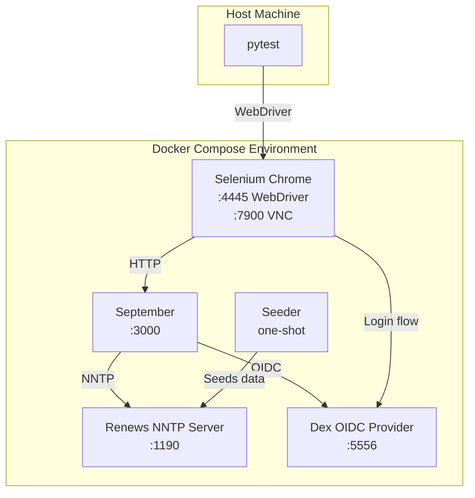

# Testing

September uses a multi-layered testing approach combining Rust unit tests with Python integration tests.

## Test Categories

| Type | Location | Framework | Description |
|------|----------|-----------|-------------|
| Unit | `src/**/*.rs` | Rust test | In-module tests for functions, types, and constants |
| Integration | `tests/integration/` | Python + Selenium | End-to-end browser automation tests |
| Manual | Documented in `features.yml` | Human verification | Production scenarios requiring manual verification |

## Running Tests

### Unit Tests

```bash
# Run all unit tests
cargo test

# Run tests for a specific module
cargo test nntp::messages

# Run tests with output
cargo test -- --nocapture
```

### Integration Tests

The integration tests require a Docker environment with NNTP server, OIDC provider, and browser automation.

#### Quick Start

```bash
# Start environment and run tests
cd tests/integration/environment
./setup.sh                    # Start Docker services and seed data

cd ..
uv run pytest                 # Run all tests
uv run pytest -v              # Verbose output
uv run pytest -k "test_home"  # Run specific tests

cd environment
./teardown.sh                 # Cleanup
```

#### Manual Environment Control

```bash
cd tests/integration/environment

# Start services
docker compose up -d --build

# Wait for services to be healthy
docker compose ps

# Seed test data
docker compose run --rm seeder

# Run tests (from tests/integration/)
cd ..
uv run pytest

# View logs
docker compose logs -f september

# Cleanup
docker compose down -v
```

## Integration Test Environment



### Services

| Service | Image | Purpose | Ports |
|---------|-------|---------|-------|
| `nntp` | Renews (custom build) | NNTP server for testing | 1190 (external) → 119 (internal) |
| `dex` | `ghcr.io/dexidp/dex:v2.41.1` | OIDC provider with static users | 5556 |
| `september` | Custom build | Application under test | 3000 |
| `chrome` | `selenium/standalone-chrome:131.0` | Browser automation | 4445 (WebDriver), 7900 (VNC) |
| `seeder` | `python:3.12-slim` | Seeds test data (runs once) | N/A |

### Test Data

Test data is seeded by `seed_nntp.py`:

**Groups:**
- `test.general` - General discussion
- `test.development` - Development topics
- `test.announce` - Announcements

**Users:**
- NNTP: `testposter` / `testpassword`
- Dex OIDC: `admin@example.com` / `password`

**Sample Content:**
- Multiple threads with varying reply counts
- Articles with different dates for pagination testing
- Threaded conversations for reply chain testing

### Configuration Files

| File | Purpose |
|------|---------|
| `environment/config/september.toml` | September configuration for test environment |
| `environment/config/dex.yaml` | Dex OIDC provider configuration |
| `environment/config/renews.toml` | Renews NNTP server configuration |

## Test Structure

### Page Objects

Integration tests use the Page Object pattern for maintainability:

| Page Object | Location | Description |
|-------------|----------|-------------|
| `BasePage` | `pages/base.py` | Common page functionality |
| `HomePage` | `pages/home.py` | Homepage, group listing, search |
| `BrowsePage` | `pages/browse.py` | Group hierarchy browser |
| `GroupPage` | `pages/group.py` | Thread list for a newsgroup |
| `ThreadPage` | `pages/thread.py` | Thread view with articles |
| `ArticlePage` | `pages/article.py` | Single article view |
| `ComposePage` | `pages/compose.py` | New post and reply forms |
| `DexPage` | `pages/dex.py` | Dex OIDC login flow automation |

### Test Modules

| Module | Location | Coverage |
|--------|----------|----------|
| `test_home.py` | Homepage, browsing, search, static files |
| `test_threads.py` | Thread lists, thread views, pagination |
| `test_articles.py` | Article viewing, navigation, error handling |
| `test_auth.py` | OIDC login, logout, session persistence |
| `test_posting.py` | Compose form, post submission, replies |
| `test_http_headers.py` | Cache-Control headers, request IDs |
| `test_observability.py` | Logging verification (coalescing, capabilities) |
| `test_visibility_latency.py` | Post visibility timing |

### Helpers

| Module | Location | Purpose |
|--------|----------|---------|
| `helpers/data.py` | Test data generation |
| `helpers/logs.py` | Log parsing and verification |
| `helpers/waits.py` | Custom wait conditions |
| `helpers/selectors.py` | CSS/XPath selectors |
| `helpers/exceptions.py` | Custom test exceptions |

### Test Fixtures

Key pytest fixtures in `conftest.py`:

| Fixture | Scope | Description |
|---------|-------|-------------|
| `driver` | function | Selenium WebDriver instance |
| `authenticated_driver` | function | Driver with completed OIDC login |
| `base_url` | session | September base URL |
| `nntp_connection` | function | Direct NNTP connection for data setup |

## Debugging

### VNC Access

Watch browser automation in real-time:

1. Connect VNC client to `localhost:7900`
2. Password: `secret`
3. View Chrome browser executing tests

### Container Logs

```bash
# All services
docker compose logs -f

# Specific service
docker compose logs -f september

# With timestamps
docker compose logs -f --timestamps september
```

### Test Logging

The `testlogging/` module provides utilities for test analysis:

| Module | Purpose |
|--------|---------|
| `capture.py` | Log capture during tests |
| `analysis.py` | Log pattern analysis |
| `visibility.py` | Post visibility verification |
| `performance.py` | Performance metrics |
| `models.py` | Data models for log entries |

### Common Issues

**Tests fail to connect to Chrome:**
- Ensure Docker services are healthy: `docker compose ps`
- Check Chrome logs: `docker compose logs chrome`
- Verify port 4445 is accessible

**Authentication tests fail:**
- Verify Dex is running: `curl http://localhost:5556/dex/.well-known/openid-configuration`
- Check September logs for OIDC errors
- Ensure cookie secret is set in environment

**NNTP operations fail:**
- Verify Renews is healthy: `docker compose logs nntp`
- Check seeder ran successfully: `docker compose logs seeder`
- Test direct NNTP connection: `nc localhost 1190`

**Flaky tests:**
- Increase wait timeouts in helpers
- Check for race conditions in page loads
- Review VNC recording for UI timing issues

## CI Integration

For CI pipelines, use the setup/teardown scripts:

```yaml
# GitHub Actions example
- name: Start test environment
  run: |
    cd tests/integration/environment
    ./setup.sh

- name: Run integration tests
  run: |
    cd tests/integration
    uv run pytest --junitxml=results.xml

- name: Cleanup
  if: always()
  run: |
    cd tests/integration/environment
    ./teardown.sh
```

## Test Coverage Mapping

Tests are mapped to requirements in `features.yml` via the `tested-by` field. Each requirement references one or more test cases:

```yaml
requirements:
  rt-1:
    description: "The system SHALL serve the homepage at GET /"
    status: Complete
    tested-by: [py-homepage-loads]

test-cases:
  py-homepage-loads:
    name: "test_homepage_loads"
    file: "tests/integration/test_home.py"
    description: "Given homepage URL, when accessed, then page loads with main content"
    passing: true
    type: integration
```

Run `uv run feature-status.py` to see coverage summary.
